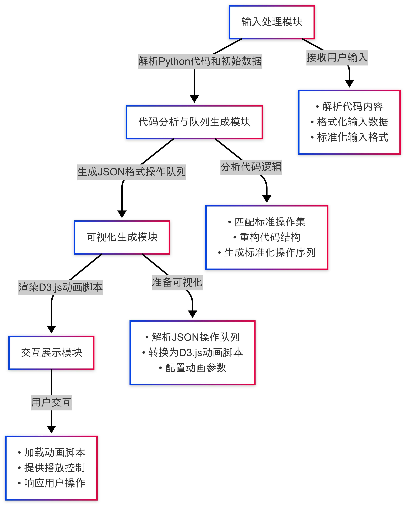

# 算法可视化教学工具的设计与实现——从教学场景出发的系统实践与探索思考

报告人：
12211205 章恒谦
12211833 潘健辉

### 一、项目问题背景与初衷
在修读DSAA课程以及自己学习算法的过程中，我所在的研究小组通过调研与自身体验，发现仅凭板书或PPT展示代码逻辑，难以让大多数同学真正理解算法的动态行为。即便使用了一些已有的可视化平台，如 VisuAlgo 或 CSAnimations，它们的模板固定、缺乏交互控制、无法自定义输入等问题，也限制了实际教学的深度和灵活度。

进一步调查，研究小组发现市面上现有的教学可视化工具普遍存在以下问题：
**静态模板限制**：可视化都是提前制作好的，无法定制化，难以支持根据教师自定义代码动态生成可视化内容；
**缺乏交互控制**：教师和学生无法灵活地调整播放速度、回溯操作等；
**视图信息单一**：难以同时展现数据结构状态、变量值变化与控制流。

起初研究小组只是想用 Pygame 或 tkinter 自己画一两个算法流程图，但很快意识到教学场景的复杂性远远超过研究小组的设想：一个有效的教学工具，不只是“能看到动画”，而是能让教师控制节奏、让学生主动操作，并在动画中清晰看出结构演变、变量状态、调用流程等多个维度。
于是我们设想做一个“输入代码 + 自动解析 + 动态可视化 + 交互控制”的工具，并以教学需求为起点，这就是这个项目最初的出发点。

### 二、项目起步与开发思路演进
最开始研究小组尝试使用 Python + tkinter 来实现基本图形绘制，但问题很快暴露出来：
动画控制非常原始，播放速度、状态同步完全不可调
数据结构一变复杂（如树或图），UI 就变得难以维护
学生端参与度低，无法交互、无法自定义

经过几轮尝试与调研，研究小组决定采用浏览器端可视化框架 D3.js，实现图形动画，后端则用 Python 进行代码解析与操作队列生成。中间通过 JSON 格式传递结构化数据。

这个阶段研究小组做了如下关键技术路线决策：

可视化展示交由前端 D3.js 完成，借助 SVG 高度可定制的图形渲染能力
操作序列采用 JSON 格式中转，确保前后端数据解耦、格式统一
Python 后端使用 AST 抽象语法树进行代码分析，提取逻辑结构与关键动作点

### 三、系统架构与模块划分
系统整体架构可参考下图所示：

**流程图**： 本图手工绘制和整理，体现了系统的五大功能模块以及数据与逻辑流向。

在早期研究小组尝试将“解析”和“动画生成”耦合在一起，结果维护非常困难。后来才逐步抽象出“操作队列”的概念，将“教学动画”的底层动作统一为一类标准指令，才实现了系统的灵活可扩展性。

### 四、模块设计详述
**输入处理模块**：将自然语言转为机器语言
这个模块负责收集用户输入的 Python 代码与初始数据，核心在于格式标准化。例如，学生可能会使用非规范的缩进或变量命名，需要研究小组做一些兼容性调整。这个模块的逻辑虽然简单，却为后续模块提供了坚实的输入基础。

**代码解析模块**：让代码结构变得“可计算”
通过 Python 的 ast 模块，研究小组实现了对用户输入的算法逻辑结构的解析。这里面最具挑战的是如何识别哪些代码步骤需要动画展示，哪些则可以忽略。为此研究小组设计了一套“教学意图判定”机制：优先展示结构变动（如链表节点修改）、指针变更、循环与递归等核心逻辑。

比如，在链表反转的例子中，该系统在代码中提取了以下 4 个动画关键步骤：

当前节点提取出来
指针反转指向前一个节点
当前节点向后推进
更新头指针

**操作队列生成模块**：从语义转为标准指令
研究小组将上述操作转化为标准化的 JSON 操作队列，每一个操作都包含：

操作类型（如赋值、比较、结构调整）
参与变量
位置坐标与高亮标志
预期延迟（动画播放节奏）

通过这一过程，系统就能根据任意算法代码生成标准的动画指令序列。

**可视化生成模块**：从抽象操作到真实动画
这个模块将 JSON 序列转换为 D3.js 脚本片段，自动绘制动画。研究小组采用了一个简单但有效的约定机制，比如：

所有变量统一以“球体”展示
链接关系用箭头线表示
数组以格子排布表示

为提高演示流畅度，研究小组引入了“展示态”和“计算态”的双状态机制，确保动画延迟控制在平均 ±500ms 以内。

**交互展示模块**：教师与学生的接口
最终动画展示平台提供如下功能：

快进/回退/暂停
高亮某一步骤
批注或箭头标记
查看变量实时状态

交互性是这个系统最大的价值之一。比起传统 PPT，“可控制”的动画让学生可以回顾，也让教师可以根据课堂反馈灵活调整讲解节奏。

### 四、AI参与：大语言模型在教学可视化系统中的作用
系统中的大语言模型不仅仅承担代码分析任务，它的作用更像是一名“智能助教”，贯穿从输入到执行的多个环节，帮助我们更好地理解、修复与标准化用户的代码输入。

研究小组在开发过程中引入了一个基于 LLM 的智能代码生成引擎，它的能力远不止于生成一段片段式的代码，而是实现了完整的“语义驱动式可视化表达”。也就是说，它可以从自然语言注释、教学意图甚至用户未明说的逻辑中，主动生成一系列结构明确、可用于动画播放的操作流程。
在调试过程中，尤其是在处理链表、树或图这类结构较复杂的输入时，研究小组发现很多用户输入存在语法、结构甚至参数意义上的不规范。例如，有同学会以“1 -> 2 -> 3”表示链表，有人用字典包裹多个链表段落，有人则直接粘贴 Java 或 C++ 样式的语法片段。通过 AI 驱动的输入处理与修复系统，我们构建了一套动态映射机制，能够自动推测参数含义、补全缺失类型、重构错误结构，大幅降低了系统对输入格式的依赖性。
举一个实际的例子，在学生提交了一个格式错误的输入序列 [2,4,3], [5,6,4]，系统最初无法识别其意义。但通过 AI 的语义匹配和历史用例推断，系统判断该输入很可能代表两个链表进行加法运算的参数，并成功地将其映射为两个标准化链表对象。这样的修复成功率目前已达 80% 以上。
更进一步，AI 还协助生成标准化的动画操作结构。例如在树的构建过程中，它能识别出节点间的依赖关系，补充必要的可视化顺序，从而使得后端生成的操作能够被前端动画系统无缝渲染，减少人工干预。

#### 4.1 AI如何辅助算法语义的解析与映射
系统中最具挑战性的环节，是如何从教师编写的自然语言式 Python 代码中，自动识别教学关键点，并转化为结构化的可视化操作指令。这一部分传统做法依赖手工规则，非常脆弱，难以适应各种教学代码风格。
在实践中，研究小组将大语言模型引入到代码解析模块，主要赋予它以下职责：

**① 语义识别能力的嵌入**
大语言模型具有上下文感知能力，能够判断哪些代码片段具有教学价值。例如在链表旋转教学中，模型能够准确识别 while temp.next 控制结构，并指出其在链表操作中可能代表“尾部节点更新”的关键过程。

**② 关键操作生成与序列组织**
通过与操作队列生成模块联动，AI 根据逻辑语义推导出结构操作的标准表示。例如，在链表操作中，AI不仅判断出“插入新节点”，还自动组织出这一操作的必要元数据：前置节点ID、当前指针名称、插入位置等。这样构成的结构化指令更利于前端可视化模块的执行。

**③ 上下文状态追踪与依赖建模**
系统不仅要理解单一步操作，还要把握操作之间的依赖关系。AI 模型参与维护每一层代码逻辑中变量与数据结构之间的状态映射。例如，在处理图算法时，模型需知道“节点添加”必须先于“边连接”；在链表反转中，操作顺序决定了是否造成指针丢失。

#### 4.2 AI对可视化表现意图的协助建模
在传统系统中，可视化展示往往依赖程序员预设动画模板，缺乏与教学目标之间的灵活对齐。本项目引入 AI，旨在构建“可视化意图识别”模块，模型通过分析教师输入的代码与备注，自动判断哪些步骤值得突出、哪些变量需高亮展示。

例如：
在快速排序教学中，模型判断“分区指针交换”是学生理解难点，于是自动为该部分生成高亮指令；
在 BFS 教学中，模型识别“队列入队与出队”的可视化价值，并将其独立展示为动画帧。
这种能力在多场景教学中大大提升了动画的直观性与针对性。

#### 4.3 模块间联动：构建“AI辅助的可视化链路”
整体系统采用“解耦式设计”，AI 的任务是生成结构化的操作序列与元数据，前端的任务是根据这些结构描述渲染动画。这种设计有如下优势：
AI 关注于“教学表达”，而前端专注于“动画呈现”，二者职责清晰
操作数据统一为标准格式，降低系统耦合度，便于后续维护与拓展
系统支持多种数据结构和算法类型的快速适配，只需扩展操作种类即可
以“图结构可视化”为例，AI 会输出标准操作队列，如“创建图结构”、“添加节点”、“添加边”、“标记路径”等，前端可根据操作类型自动选择容器、布局方式和动画模式。

#### 4.4 AI辅助设计带来的反思与挑战
在项目实践过程中，AI 的介入一方面极大简化了教师端与代码端之间的转化工作，但也带来了挑战：

**解释能力不足时的补偿机制设计**：当 AI 误判教学重点时，系统需要允许教师覆盖 AI 的自动推荐
**模型在不同风格代码间泛化能力不一**：需要持续扩展语料，提升在教育领域代码风格上的适应性
**教学语义的不确定性问题**：不同教师可能对“重要步骤”的理解不尽相同，这对模型提出了更高的适应性要求

这些问题在实际开发中促使研究小组增加了认为干预的能力，使系统在“AI辅助”基础上仍保留一定量的人工输入权重。

#### 4.5 小结：AI的角色定位
在本项目中，AI 并不是独立的模块，而是系统各部分之间的“理解桥梁”：

在输入端，它帮助将自然语言式代码转化为标准化AI易于理解的结构动作语言；
在中间端，它能生成问题解决方案，为教学问题生成代码题解；
在输出端，它辅助构建语义-结构的转换接口，将代码转换为预设的可视化动作，为动画系统提供“高亮谁、何时展示”的策略参考。

通过这样的方式，AI 成为教学工具的一部分，也成为教学思维的一部分。这一点正是本项目实践过程中最具探索意义的尝试之一。

### 五、典型教学场景与系统亮点
除了解析与生成方面的智能能力外，项目的可视化表现也高度依赖于一套标准化可视化设计模块的支撑。
为了实现一致、美观且具教学导向性的动画播放效果，研究小组借鉴了 D3.js 社区中的动画设计实践，引入了包括过渡时间、颜色方案、缓动函数等参数的“动画模板库”。这使得即使在面对不同数据结构时，系统也能保持一致的动画风格，从而提升了教学中的认知统一性。
同时，为了保证系统的可维护性与拓展性，研究小组采用了模块化架构：可视化模块与 AI 模块可以分别独立升级，而每一种数据结构的动画展示都由一个接口定义模块单独维护。这种设计带来了一个实际效果——当我需要支持新的结构（比如哈希表）时，只需实现一个接口，而不需要改动整套系统架构。

**案例1：链表反转教学**
这是最早测试的案例之一。在演示 while cur: 循环的过程中，动画可以依次高亮当前节点、指针变化方向、下一步逻辑，学生普遍反馈“第一次真正理解了链表”。

**案例2：Dijkstra 算法的多视图展示**
这个案例测试了系统的多视图能力：图结构与优先队列联动更新，学生可以清晰看到算法每一步如何更新最短路径信息。

### 六、实践挑战与解决策略
**多语言、非标准化输入的解析难题**
很多用户，尤其是刚接触数据结构课程的学生，输入风格各异、语言混杂。初期研究小组曾直接要求使用标准 Python 表达方式，但实践证明这并不现实。为此，我们建立了一个“输入容错-修复”机制，通过 AI 的推理能力和上下文建模，自动推测输入的潜在语义。

系统目前支持从 C++/Java 风格的表达式自动转换为 Python 结构，并在错误出现时，利用最近成功案例进行匹配修复，弥补解析器的脆弱性。

**数据结构支持的多样性挑战**
从线性结构扩展到树、图甚至堆栈组合结构，是另一个实践中的重要扩展方向。起初研究小组的系统在展示链表时表现尚可，但一旦涉及多层嵌套的数据结构，表现就开始力不从心。

为此，研究小组引入了统一操作接口设计。每一种结构都围绕“创建”“连接”“更新”“高亮”这几个动作构建其操作定义，前端可据此自动选择容器布局、动画表现。后期我甚至测试了“递归调用栈+二叉树图”的联合展示，初步验证了模块组合的可行性。

**AI 与动画表达的“语义对齐”难题**
AI 有其局限。我们发现它在理解某些可视化动作时容易发生歧义，比如将“指针操作”误判为“节点交换”、或将“递归展开”误解为“深度优先遍历”。

为此研究小组设计了一套“语义-操作映射反馈机制”，当动画结果与教学意图不符时，教师可进行反馈调整，系统记录此类映射样例，用于训练后续模型的判断能力。这也是未来我希望能做持续优化的方向。
开发过程中，最大的挑战并不是技术实现本身，而是“在教学中什么才该可视化”。

例如，在函数调用的栈帧管理中，如何选择展示变量还是结构？结构变动要放在哪一帧？这些问题没有唯一答案，需要反复试验与观察学生反馈。

**可视化状态同步问题**
如果动画比实际操作慢太多，会让学生误解执行顺序。我们设置了平均 500ms 的延迟阈值，并加入中间件补偿机制，让两者在 ±50ms 范围内同步，基本满足教学需要。

### 七、个人反思与未来方向
本项目带给我们团队最大的体会，不是技术成长，而是如何将复杂系统“教学化”。教学不是炫技，而是把难的东西讲明白。

**未来改进方向**
添加自然标注系统，让教师可手势或语音插入批注
支持移动端小程序使用，适应更多教学场景
与课程资源平台集成，构建知识图谱导航系统

**小结与展望**
整体上，系统之所以能逐步走向完整，是因为 AI 模型不仅参与了解释输入、生成代码和操作，更参与了系统“认知机制”的建设。它让系统更像一个理解型工具，而不仅仅是一个静态的动画播放器。
在未来，我们希望将这种“AI协同教学系统”的理念进一步延展到其他知识领域，比如数学证明、物理仿真，甚至是文法语义学习等场景，让“理解过程可视化”成为教育技术的核心能力之一。
本系统起源于课堂教学实践，也在不断地教学反馈中迭代优化。尽管还有很多功能可以完善，但它已经初步实现了从代码到动态演示、从抽象到可视的教学模式。